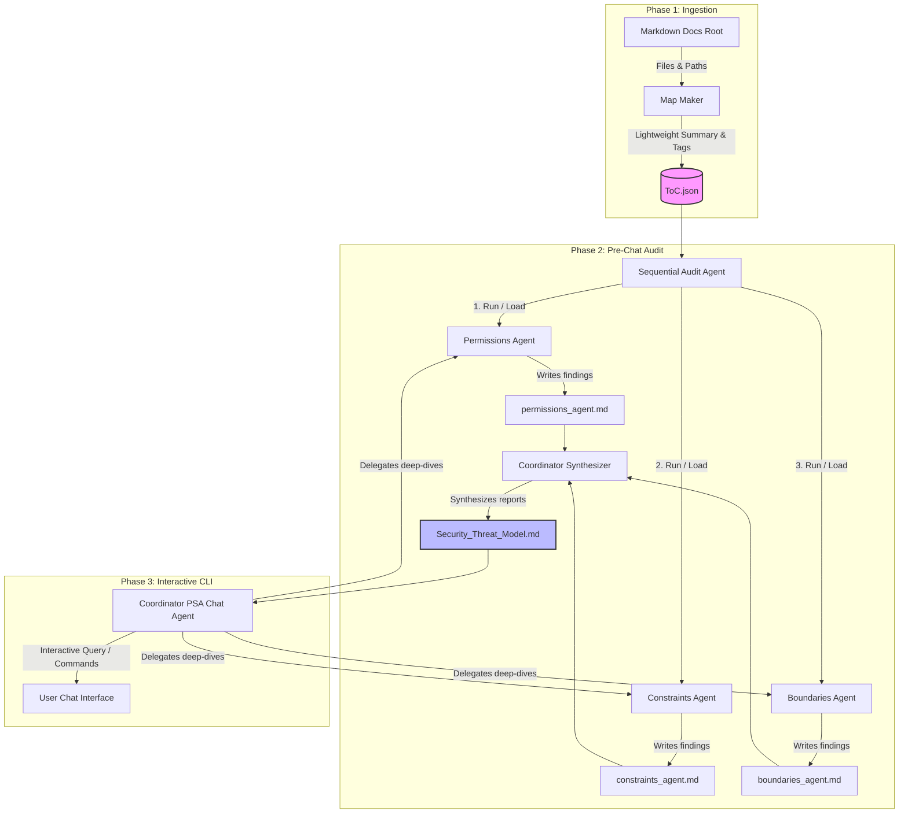

# DocsDiver (Security Documentation Analysis Agent - SDAA)
## Comprehensive Technical Project Description

This document provides a highly detailed description of **DocsDiver** (also known as **SDAA**), an automated security auditing tool built with the **Google Agent Development Kit (ADK)**. It contains sufficient design, architectural, and operational details to enable an experienced software engineer to recreate the system.

---

## 1. Intent and Objective

Vulnerabilities in software applications often stem from design flaws, architectural oversights, and logical contradictions that are introduced early in the development lifecycle. While static analysis (SAST) and dynamic analysis (DAST) inspect code and running systems, they are blind to the high-level intent, security guarantees, and business-logic constraints described in technical documentation.

**DocsDiver** bridges this gap. It acts as an automated **Principal Security Architect (PSA)** that ingests technical documentation (in Markdown format) to:
1.  Map the system's architecture, trust boundaries, and components.
2.  Uncover logical contradictions between different parts of the documentation (e.g., one document claiming a function is admin-only, and another describing it as publicly accessible).
3.  Audit role-based access control (RBAC) and permissions invariants.
4.  Identify missing security controls (e.g., lack of rate-limiting, audit logs, or input validation).
5.  Generate a consolidated **Security Threat Model** and a **Master Test Plan** containing prioritized, actionable security test cases.

---

## 2. System Architecture & Topology

DocsDiver is built using the **ADK Hierarchical Coordinator Pattern** and operates in three distinct phases: **Ingestion & Mapping (Map Maker)**, **Sequential Pre-Chat Audit**, and **Interactive CLI Session**.

### Architectural Diagram



---

## 3. Detailed Component Specifications

### 3.1. Ingestion Layer: The Map Maker (`sdaa/src/core/map_maker.py`)
Before the agentic runtime begins, DocsDiver builds a semantic index of the target documentation. This index is written to a Table of Contents file (`ToC.json`) and serves as the primary metadata index for the worker agents.

#### Scan Logic
1.  Recursively walks the directory specified by `system.docs_root` to locate all `.md` files.
2.  For each file, it reads the content and sends it to a lightweight LLM (configured under `agents.map_maker`).
3.  The LLM is prompted to summarize the file and assign exactly three metadata tags.

#### Ingestion Prompt
```text
You are helping build a navigation map for a documentation corpus.
Read the following content and:
1. Provide a one-sentence architectural summary.
2. Provide exactly three short, lowercase keyword tags that are descriptive of the file's subject. These keyword tags must be nouns or adjectives, and must not be duplicated.

Return ONLY valid JSON. Do not include any other text before or after the JSON.
{
  "summary": "<one sentence>",
  "tags": ["tag1", "tag2", "tag3"]
}

Content:
<File Content Here>
```

#### Fallback Tagging Logic
If the model response fails to parse, or if it fails to return exactly three tags, the system uses a regex-based fallback `_derive_tags_from_path(filepath)`:
- Extracts segments from the file path, strips extensions, and splits tokens on non-alphanumeric characters.
- Converts tokens to lowercase and ensures exactly three unique tags are produced by truncating or padding with the last available token.

#### `ToC.json` Schema
```json
{
  "files": [
    {
      "path": "docs/auth/login.md",
      "summary": "Handles user authentication and JWT session creation.",
      "tags": ["auth", "jwt", "login"]
    }
  ]
}
```

---

### 3.2. Agent Layer (`sdaa/src/agents/`)

The agent runtime is structured hierarchically. The **Coordinator** is the supervisor and delegates tasks to three specialized **Worker Agents**.

#### 1. Coordinator Agent (`coordinator_psa`)
- **Interactive Mode:** Loaded with tools `read_file` and `generate_final_report`. It acts as the supervisor, orchestrating the interactive session. When asked a broad question, it delegates sub-tasks to the worker agents and synthesizes their outputs.
- **Synthesizer Mode (`create_coordinator_synthesizer`):** Used during the pre-chat audit. It accepts no sub-agents. It compiles a synthesis prompt using the markdown findings from all three workers (either generated or loaded from disk) and formats the final `Security_Threat_Model.md` report.

#### 2. Permissions Agent (`permissions_agent`)
- **Objective:** Maps permissions, roles, groups, and authorization models (RBAC/ABAC).
- **Tools:** `read_file`, `list_files`, `report_permissions_matrix`.
- **Output Artifact:** Saves findings to `output/artifacts/permissions_agent.md`.

#### 3. Constraints Agent (`constraints_agent`)
- **Objective:** Identifies negative constraints (things that *must not* happen), security assumptions, invariants, and business-logic assertions.
- **Tools:** `read_file`, `list_files`, `report_invariance_findings`.
- **Output Artifact:** Saves findings to `output/artifacts/constraints_agent.md`.

#### 4. Boundaries Agent (`boundaries_agent`)
- **Objective:** Maps trust boundaries, interfaces, network ingress/egress points, and external dependencies.
- **Tools:** `read_file`, `list_files`, `report_boundary_analysis`.
- **Output Artifact:** Saves findings to `output/artifacts/boundaries_agent.md`.

#### Prompt Sanitization & Management
All worker and coordinator prompts are retrieved from a centralized **Langfuse Prompt Management** service. 
- **The ADK Template Engine Collision:** The Google ADK parses curly braces `{}` in agent instruction prompts as variables to compile at runtime. If a retrieved prompt contains curly braces (e.g., describing a JSON payload like `{"user_id": {id}}`), the ADK template engine crashes.
- **Sanitization Solution:** The system processes all fetched prompts with a regex sanitization layer:
  - Worker prompts: `re.sub(r"\{([a-zA-Z_]\w*)\}", r"(\1)", prompt)` to escape braces.
  - Boundaries prompt: Explicitly calls `.replace("{", "{{").replace("}", "}}")` to ensure braces are doubled, escaping them for the ADK template compiler.

---

## 3.3. Tooling Layer (`sdaa/src/tools/`)

#### File Operations (`file_ops.py`)
- `read_file(file_path)`: Resolves absolute and relative paths. It strictly validates that target paths reside inside the `system.docs_root` directory using `os.path.abspath` and `.startswith()` to prevent **Path Traversal** attacks by malicious/hallucinated LLM requests. It includes a special exemption to allow reading the generated `ToC.json` from the output directory.
- `list_files(directory_path)`: Scans the target directory and returns relative paths for `.md` files.

#### Reporting Utilities (`reporting.py`)
Defines Pydantic models for structured output and saves markdown findings:
- `report_permissions_matrix(findings: str)` -> Writes permissions findings to `output/artifacts/permissions_agent.md`.
- `report_invariance_findings(findings: str)` -> Writes constraints findings to `output/artifacts/constraints_agent.md`.
- `report_boundary_analysis(boundaries_markdown: str)` -> Writes boundary analysis to `output/artifacts/boundaries_agent.md`.
- `generate_final_report(report_content: str)` -> Saves the synthesized report to `output/reports/Security_Threat_Model.md`.

---

## 3.4. LLM Model Layer (`sdaa/src/utils/` & `sdaa/src/core/model_factory.py`)

To support multiple models (Gemini, OpenRouter, Mock, and local artifacts), DocsDiver utilizes a factory pattern returning customized `BaseLlm` wrappers.

#### 1. Instrumented Gemini (`sdaa/src/utils/instrumented_gemini.py`)
Inherits from ADK `Gemini`. Overrides `generate_content_async` to start an OpenTelemetry trace span and adds attributes to link the generation back to the specific Langfuse-managed prompt name and version:
- `langfuse.observation.prompt.name`
- `langfuse.observation.prompt.version`

#### 2. OpenRouter Model Wrapper (`sdaa/src/utils/openrouter_model.py`)
Integrates OpenRouter endpoints using the standard OpenAI client. Re-maps the ADK request structure (designed for Gemini) to OpenAI payload formats.

- **Tool Call Schema Conversion:** Recursively converts Gemini `Schema` objects (e.g., `Type.STRING`, `Type.OBJECT`) into compliant JSON Schema formats.
- **OpenAI Tool Formatting:** Packs Gemini function declarations into OpenAI's `{"type": "function", "function": {...}}` format.
- **History Reconstruction & ID Alignment:**
  - OpenAI APIs require strict matching between the `tool_call_id` in a tool response and the `id` in the preceding assistant message. 
  - To prevent mismatches, when reconstructing conversation history, `OpenRouterModel` keeps track of the tool index per message and forces an ADK-compliant ID format: `f"functions.{function_name}:{tool_index}"`.
  - It also handles cases where OpenAI models/endpoints reject `content: null` when `tool_calls` are present by setting `content` to `""` (empty string).
- **Reasoning Models Support (Grok):**
  - If the model is `x-ai/grok-4.1-fast`, the wrapper injects `extra_body={"reasoning": {"enabled": True}}` into the completion request.
  - It intercepts `reasoning_details` in the response choice and serializes them into the ADK output using the custom MIME type `application/x-reasoning-details` in a `types.Blob` block.
  - When reconstructing history for subsequent turns, it deserializes this blob to return reasoning data back to the model.

#### 3. Artifact Loader Model (`sdaa/src/utils/artifact_loader_model.py`)
This optimization model bypasses expensive LLM execution. When the pre-chat audit runs, if a worker's output already exists in `output/artifacts/`, the model factory loads `ArtifactLoaderModel` instead of a real LLM.
- **Two-Step Execution Simulation:**
  - **Step 1:** On the first generation request, it returns a `types.FunctionCall` targeting the worker's reporting tool (e.g. `report_permissions_matrix`) with the cached file content passed as the argument.
  - **Step 2:** After the ADK runner executes the tool and sends back the `FunctionResponse` in the history, the model returns a text confirmation completion. This mimics a real tool execution sequence, keeping the ADK runner history consistent.

---

## 3.5. Observability & Tracing Layer (`sdaa/src/core/instrumentation.py`)

DocsDiver integrates OpenTelemetry with a dual-platform backend configuration: **LangSmith** and **Langfuse**.

- **LangSmith Setup:** Automatically initialized using `langsmith.integrations.otel.configure` which provisions the global tracer provider.
- **Langfuse Setup:** Connects via a manual HTTP OTLP Exporter pointing to the `/api/public/otel/v1/traces` endpoint. Authenticates with a base64-encoded `Basic` header derived from the public and secret keys.
- **Unreachable Guard:** Performs a lightweight `requests.get` check against `LANGFUSE_HOST/api/public/health` with a 1-second timeout. If unreachable, the exporter is skipped to prevent noisy connection warnings from disrupting the terminal UI.
- **TaggingSpanProcessor:** Appends root span tags `["ADK-DocsDiver"]` to both `langfuse.trace.tags` and `langsmith.span.tags`.
- **Instrumentation:** Registers `GoogleADKInstrumentor().instrument()` to trace all ADK execution graphs.

---

## 4. Operation and Execution Workflow

### 4.1. Configuration (`config.yaml`)
```yaml
system:
  toc_filename: "ToC.json"
  docs_root: "docs-for-testing"
  output_dir: "output"
  reports_dir: "reports"
  artifacts_dir: "artifacts"

providers:
  gemini:
    model_name: "gemini-2.5-pro"
  openrouter:
    base_url: "https://openrouter.ai/api/v1"
    model_name: "google/gemini-2.5-pro"

agents:
  map_maker:
    openrouter: "google/gemma-3-27b-it"
    gemini: "gemini-2.0-flash-001"
  coordinator:
    openrouter: "x-ai/grok-4.1-fast"
    gemini: "gemini-2.5-pro"
    prompt:
      name: "coordinator-agent"
      label: "production"
  permissions_agent:
    openrouter: "x-ai/grok-4.1-fast"
    gemini: "gemini-2.5-flash"
    prompt:
      name: "permissions-agent"
      label: "production"
```

### 4.2. CLI Flags
DocsDiver exposes several CLI flags in `main.py` to control optimization and debugging:
- `-m, --model [gemini|openrouter|mock]`: Selects the model provider (defaults to `openrouter`).
- `--skip-map-maker`: Reuses the existing `ToC.json` in the output directory, skipping Phase 1.
- `--toc-only`: Generates `ToC.json` and exits without running any audits or interactive loops.
- `--coordinator-only`: Skips both Map Maker and Worker agent executions, using existing worker artifacts to synthesize only the final report.
- `--no-rich`: Disables the styled terminal panels and outputs plain text logs (useful for piped shells or CI/CD).

### 4.3. Pre-Chat Audit Workflow (Phase 2.5)
When the application starts, it verifies if all four output files exist (`permissions_agent.md`, `constraints_agent.md`, `boundaries_agent.md`, and `Security_Threat_Model.md`). If any are missing, it initializes the sequential audit agent.
1.  Creates a single session via `InMemorySessionService`.
2.  Runs the `SequentialAgent` comprising `[permissions_agent, constraints_agent, boundaries_agent, coordinator_synth]` with the user message `"Audit the application"`.
3.  Each worker agent scans the files indexed in the `ToC.json`, extracts findings, and calls its respective tool to save findings.
4.  The synthesizer agent pulls worker outputs from the session state, compiles the `report-synthesizer` prompt, and writes `Security_Threat_Model.md`.
5.  If files already exist, `ArtifactLoaderModel` loads the text from disk and plays it back to maintain the session state without calling the LLM API.

---

## 5. Guide to Recreating the Functionality

To build a clone of DocsDiver from scratch, follow this development sequence:

1.  **Dependency Setup:** Install `google-adk`, `openai`, `langfuse`, `pydantic`, `pyyaml`, `python-dotenv`, and `opentelemetry` packages.
2.  **Config Loader:** Write a singleton class to parse the nested YAML and resolve paths (expanding user tildes and making paths absolute).
3.  **Map Maker:** Write a script that scans a directory for `.md` files, calls the model to summarize each and return a JSON structure, parses code blocks or wraps the response, and falls back to filename segmentation on JSON parse errors.
4.  **Safe File Tools:** Write functions that validate path resolution relative to a base directory before doing file IO to prevent security directory traversal attacks.
5.  **OpenRouter Client Adapter:** Implement custom schema mapping from Gemini types to OpenAI JSON schema. Write history loop parsing to ensure `tool_call_id` matches the generated format deterministically and prevent null contents.
6.  **Agent Assembly:** Register workers and coordinators. Fetch instructions from a remote source, sanitizing curly brace syntax beforehand.
7.  **Pre-Chat Pipeline:** Set up sequential agent execution. Write an artifact loader wrapper to mock responses if file artifacts exist on disk.
8.  **Terminal Interface:** Use `rich` or standard stdin/stdout streaming to print model responses line-by-line using async generators.
